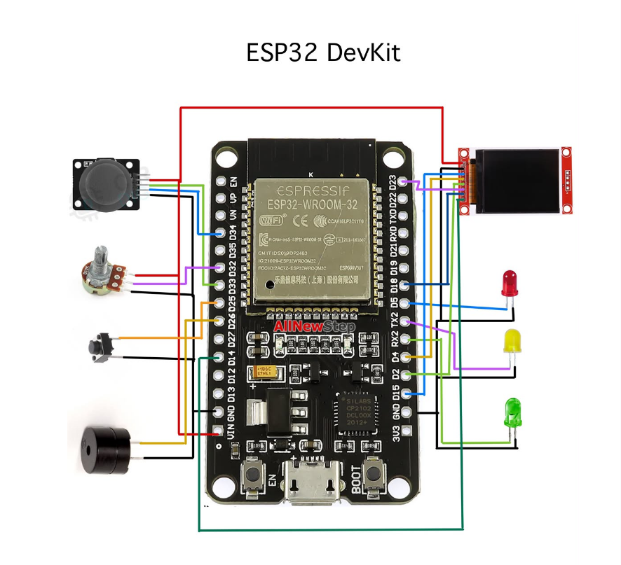

# Retro Arena Survivor

## 1) Project Title & Overview
โปรเจกต์เกมแนว Action-Survival สไตล์ Retro 8-bit บนไมโครคอนโทรลเลอร์ ESP32 ประมวลผลและแสดงผลแบบ Real-time ผ่านหน้าจอ TFT LCD (320x480) ควบคุมด้วย Analog Joystick มีระบบไฟ LED แสดงผล HP ภายนอก ระบบปรับความสว่างหน้าจอด้วย Potentiometer เสียงเอฟเฟกต์ผ่าน Buzzer และการเพิ่มความสมจริงด้วยระบบอัปเกรดตัวละคร ตัวเกมทำงานบนระบบ Non-blocking Finite State Machine (FSM) เพื่อประสิทธิภาพและความลื่นไหลสูงสุด

## 2) Picture of Actual Hardware (ภาพชิ้นงานจริง)

* **อุปกรณ์หลักในชิ้นงาน:**
  * บอร์ดไมโครคอนโทรลเลอร์ ESP32 DevKit
  * หน้าจอ TFT LCD (320x480)
  * Analog Joystick (2-Axis) ควบคุมทิศทาง
  * Potentiometer ปรับความสว่างหน้าจอ
  * Push Button ปุ่มกดใช้สกิลระเบิด
  * Status LEDs 3 สี (เขียว, เหลือง, แดง) แสดงระดับ HP ของตัวละคร
  * Passive Piezo Buzzer ขับเสียงเอฟเฟกต์

## 3) Block Diagram & Circuit Diagram

### Pin Mapping Table
| อุปกรณ์ | ขาฮาร์ดแวร์ | ขา ESP32 | หน้าที่การทำงาน |
| :--- | :--- | :--- | :--- |
| Joystick X / Y | VRx / VRy | GPIO 34 / GPIO 33 | อ่านค่าแกนอนาล็อกควบคุมการเคลื่อนที่ |
| Potentiometer | Wiper | GPIO 32 | อ่านค่าปรับความสว่างไฟ Backlight |
| Push Button | Signal | GPIO 25 | ปุ่มเปิดใช้สกิลระเบิด / ยืนยันเมนู |
| TFT Backlight | LED/BL | GPIO 14 | สัญญาณ PWM ปรับความสว่างจอ |
| Status LEDs | Green/Yellow/Red | GPIO 16 / 17 / 5 | ไฟแสดงระดับ HP ของตัวละคร |
| Passive Buzzer | Pin (+) | GPIO 26 | ส่งสัญญาณเสียงเอฟเฟกต์ SFX |

* **Datasheets อุปกรณ์เพิ่มเติม:** สามารถดาวน์โหลดและอ่านรายละเอียดได้ในโฟลเดอร์ [`docs/datasheets/`](./docs/datasheets/)

## 4) Codes
ซอร์สโค้ดฉบับสมบูรณ์ (เวอร์ชันล่าสุด) ถูกจัดเก็บอยู่ที่ [`src/main.cpp`](./src/main.cpp)

## 5) Demonstration VDO
สามารถรับชมวิดีโอสาธิตการทำงานและทดสอบระบบจริงได้ที่ลิงก์ด้านล่าง:
* **Google Drive Demo Link:** [คลิกที่นี่เพื่อรับชมวิดีโอสาธิตการทำงาน](https://drive.google.com/file/d/1wSTmqR_-Sq7AepEVBgjFIw3Xfg82Lu3q/view?usp=drive_link)

## 6) Manual Report (คู่มือการใช้งาน)

### สรุปวิธีการเล่นและระบบควบคุมเกม (Quick Start)
1. **หน้าเริ่มต้น (STATE_TITLE):** กดปุ่ม **Skill Button** บน GPIO 25 เพื่อเริ่มเข้าสู่ตัวเกม
2. **การบังคับตัวละคร (STATE_PLAYING):** 
   * โยก **Analog Joystick** เพื่อเคลื่อนที่หลบหลีกศัตรู (ตัวละครจะทำการโจมตีอัตโนมัติด้วยระยะแส้)
   * กดปุ่ม **Skill Button** เพื่อปล่อยสกิลระเบิดทำลายศัตรูรอบตัว (เมื่อสะสมเกจจนขึ้นข้อความ `[BOMB]`)
3. **การอัปเกรดตัวละคร (STATE_LEVELUP):** เมื่อเก็บ Gem ครบจนเลเวลอัป ให้โยก Joystick **ขึ้น/ลง** เพื่อเลือกลำดับหัวข้ออัปเกรด แล้วกดปุ่ม **Skill Button** เพื่อยืนยัน
4. **การปรับความสว่างหน้าจอ:** หมุนตัวปรับ **Potentiometer** บน GPIO 32 เพื่อเพิ่ม/ลดความสว่างไฟ Backlight ของจอ TFT
5. **ไฟแสดงสถานะ HP (LEDs):** ไฟสีเขียว (HP สูง) / สีเหลือง (HP ปานกลาง) / สีแดง (HP วิกฤต)

---

📄 **อ่านรายงานและคู่มือการใช้งานฉบับเต็ม (Full Manual Report):**
สามารถอ่านรายละเอียดเชิงลึก เอกสารการทดลอง และวงจรอย่างละเอียดได้ที่ไฟล์ [`docs/manual-report.pdf`](./docs/manual-report.pdf)

## 7) Presentation Files
สามารถดาวน์โหลดไฟล์นำเสนอผลงานได้ที่นี่:
* [ไฟล์สไลด์นำเสนอต้นฉบับ (.pptx)](./presentation/presentation.pptx)
* [ไฟล์สไลด์นำเสนอ (.pdf)](./presentation/presentation.pdf)
